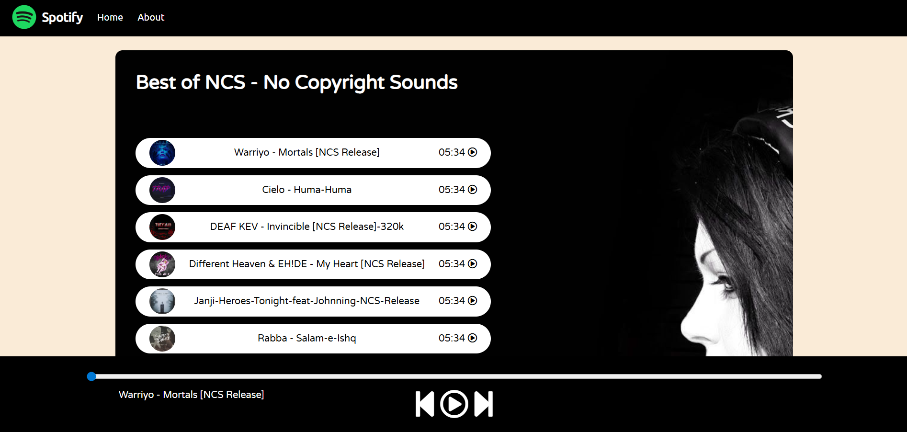

# 🎵 Spotify-Style Music Player

A simple **Spotify-inspired music player** built with HTML, CSS, and JavaScript.  
It lets you play, pause, skip, and navigate through songs stored locally in your project.

---

## 📸 App Screenshot

  


---

## ✨ Features

- 🎼 Play/Pause songs
- ⏭ Next / Previous track navigation
- 📊 Seek bar for progress control
- 🎧 Displays current song title & animated playing GIF
- 📂 Organized assets for songs, covers, and backgrounds
- 📱 Responsive design for desktop & mobile

---

## 🛠️ Technologies Used

- **HTML5** – structure
- **CSS3** – styling and responsiveness
- **JavaScript (ES6)** – interactivity
- **Font Awesome** – icons

---

## 🚀 How to Run Locally

1. **Clone this repository**  
   ```bash
   git clone https://github.com/yourusername/spotify-music-player.git

2.**Open index.html in your browser**
   Just double-click index.html or right-click → Open with → your preferred browser   
